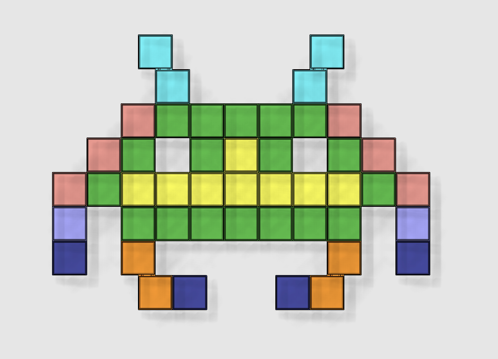

<b>Informationen zu den Würfeln</b>

Die Farbbezeichnung der einzelnen Modelle stimmt mit den Farben in den Vorschaubildern überein. Mithilfe der unterschiedlichen Aussparungen (0 bis 4 Löcher) kann man mit den Würfeln auch beliebig viele andere Motive erstellen. 
  
Die orangenen und hellblauen Teile bestehen aus zwei zusammenhängenden Würfeln, die genau um eine halbe Würfelbreite versetzt sind. Durch eine kleine Fuge sehen sie nach dem Drucken aber so aus, als hätte man sie geklebt.
  

