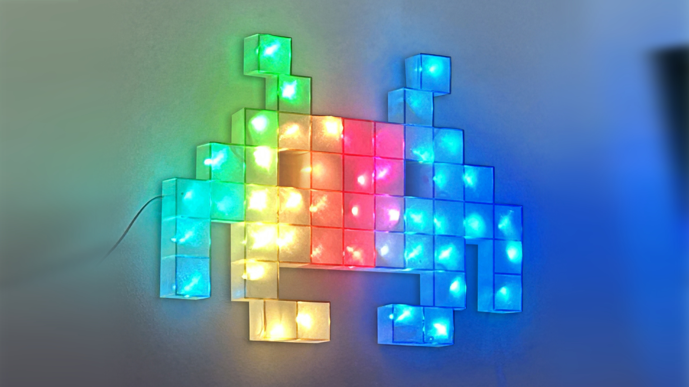

Maker Media GmbH

***

# Pixel-Lampe mit WLED

### Mit dem WLED-System und einem ESP kann man LED-Streifen ganz leicht ansteuern. An die Wand geklebt wirkt das 1D-Feuerwerk jedoch etwas verloren. Wieso also nicht eine zweidimensionale Pixel-Lampe bauen, die ordentlich Retrocharme in die Bude bringt? Der Wow-Effekt ist garantiert.

Ergänzend zum Artikel in der Make 3/24 findet ihr hier die 3D-Daten für die Würfel, eine Pinout-Grafik eines NodeMCU-Boards sowie den Python-Code zum Herunterladen.

Den vollständigen Artikel kann man in der **[Make-Ausgabe 3/24 (ab S. 58)](https://www.heise.de/select/make)** lesen.
